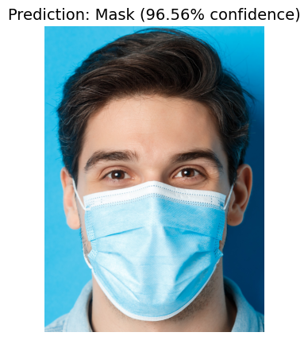

# 🚀 Face Mask Detection System using Custom SSD Architecture

This project presents a custom deep learning solution for face mask detection, developed from scratch using PyTorch. It implements a lightweight Single Shot Detector (SSD) model to localize and classify facial regions in images based on whether a mask is worn or not. By intentionally avoiding pre-trained models, the system provides a hands-on, ground-up understanding of object detection architectures, custom loss functions, data preprocessing, and GPU-accelerated training workflows.

> "Built from scratch to understand object detection from the ground up — not just to use AI, but to build it."

---

## 🎯 Project Objectives

- Build a complete object detection model from scratch 
- Detect and classify face mask usage in images
- Design and train a lightweight CNN-based SSD model
- Parse and utilize real-world annotation formats (Pascal VOC in XML)
- Train using GPU with mixed precision for optimal performance
- Visualize predictions using OpenCV

---

## 🧠 Core Features

- 📦 End-to-End Custom SSD: Custom SSD architecture with 4 convolutional layers
- 📊 Multiclass Classification: Detects 
  - with_mask
  - without_mask
- 📐 Ground Truth Matching: Custom IoU matrix-based matching logic
- 🎯 Dual Head Output: Separate regression and classification heads
- 🧮 Custom Loss Function: Combines Smooth L1 for bounding boxes and Cross Entropy for class predictions
- ⚡ Mixed Precision Training: Utilizes GPU for efficient training
- 🖼️ Visualization: Inference with bounding boxes and confidence labels

---

## 🛠️ Tech Stack

| Area | Tools / Libraries |
|------|-------------------|
| Programming Language | Python 3.10+ |
| Deep Learning Framework | PyTorch |
| Data Handling | Pandas, NumPy |
| Computer Vision | OpenCV |
| Visualization | Matplotlib |
| Annotation Parsing | XML (Pascal VOC), CSV |
| GPU Optimization | CUDA |

---

## 🗂️ Project Structure

```
├── Face_Mask_Detection_System.ipynb     # Main code notebook
├── annotations.csv                      # Converted annotations from XML (Generated through code)
├── /venv                                # Python virtual environment directory (If using virtual env for dependencies)
├── /processed_data                      # Directory of face images (Generated through code)
├── /test_images                         # Sample images for testing
├── requirements.txt                     # List of all required packages
├── Virtual_Enviroment_Commands.txt      # Python venv setup commands
└── README.md                            # This file
```

---

## ⚙️ Setup Instructions

### 1️⃣ Clone the Repository
```bash
git clone https://github.com/NoorUlBaseer/Face-Mask-Detection-System.git
cd Face-Mask-Detection-System
```

### 2️⃣ Create & Activate Virtual Environment (Windows)
```bash
python -m venv venv
venv\Scripts\activate
```

### 3️⃣ Install Required Packages
```bash
pip install -r requirements.txt
```

### 4️⃣ Launch Jupyter Notebook
```bash
jupyter notebook
```
Then open and run all cells in `Face_Mask_Detection_System.ipynb`

---

## 🔬 Training Overview

- Image resolution: 224×224
- Model architecture: 4-layer CNN + SSD heads
- Batch size: Configurable (default 32)
- Loss: Custom SSD loss = SmoothL1 + CrossEntropy
- Optimizer: Adam (lr=1e-4)
- Epochs: Default 50–100
- GPU: Trained using NVIDIA RTX 3050 Ti 

---

## 🔍 Inference Example
To run inference and visualize output:
```python
image_path = "test_images/image.jpg"
predict(image_path)
```
Sample output:

 <!-- Replace with actual output if available -->

---

## 📌 Skills Demonstrated

- Deep Learning (CNN, object detection)
- PyTorch (model design, training loop)
- SSD architecture from scratch
- IoU computation & NMS
- Image annotation parsing
- Model optimization and evaluation
- Real-time inference visualization

---

## 📥 Virtual Environment Commands
Refer to the included Virtual_Enviroment_Commands.txt file for:
- Setting up Python venv
- Activating and managing dependencies

---

## 📚 Future Improvements

- Add webcam/live video detection
- Support for YOLOv8 and comparison with custom SSD
- Deploy as a Flask API or Streamlit web app
- Evaluate on real-world test datasets

---

## 📄 License
This project is for academic use only and is licensed under the MIT License. For more details, see the [LICENSE](LICENSE.txt) file. Contributions are welcome to enhance functionality or improve performance. 

---
